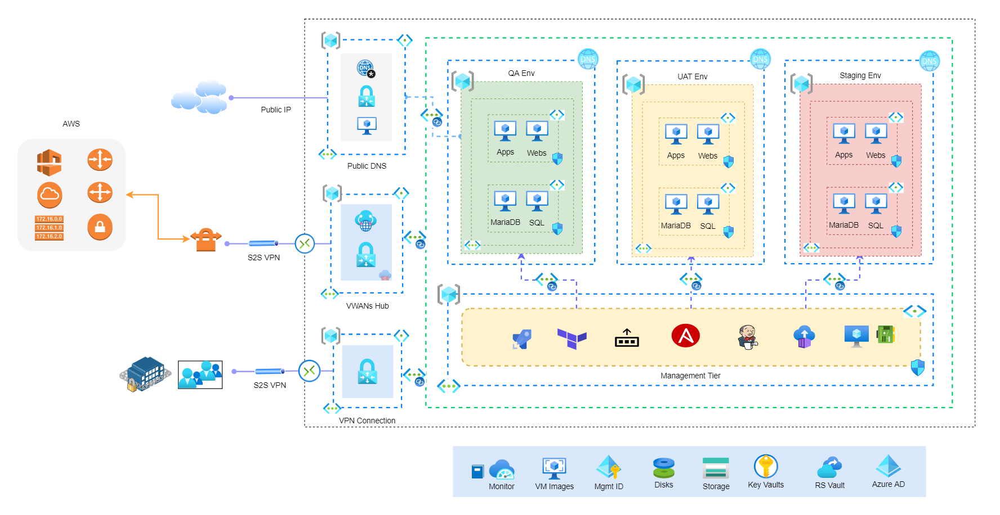

# QA Deployment Azure DevOps Pipeline III #

Create a CICD DepOps Pipeline for QA platform deployment demo.

### QA Deployment Demo

* Pipelines (git clone https://github.com/joechiu/platform-infra-pipelines.git)
* Create Resource Groups
* Peering Virtual Networks
* Create VHub Connections
* Generate VM Hashicorp
* Create AKS Cluster
* Create SQL Server - AKS Cluster
* Create Virtual Machines
* Create Teamcity VM
* Create RabbitMQ VM
* Create Tentacle VM
* Create MSSQL VM
* Create MariaDB VM (Skipped)
* Create Windows VM (Skipped)
* Create IaC VM
* Create MSSQL DB Server
* Create MariaDB Server (Skipped)
* Create Windows Application (Skipped)
* Create IaC Service
* Create Private DNS Links
* Azure VPN Client Connection / Access
* VM Conneciton / Access
* SSMS Connection
* Private DNS Connection
* Clean Up

### Systems and Tools

* Azure Cloud Portal
* Azure Cloud account
* Working Environment to Azure Cloud
* Azure DevOps Pipelins
* Docker self-host agent for Azure DevOps (https://docs.microsoft.com/en-us/azure/devops/pipelines/agents/docker?view=azure-devops)
* Github repo: https://github.com/joechiu/platform-infra-pipelines.git

### TODO

* QA Platform Design

### Pre Task
* VWAN P2S Setup: (https://docs.microsoft.com/en-us/azure/virtual-wan/virtual-wan-point-to-site-portal)
* Azure DNS forwarder

